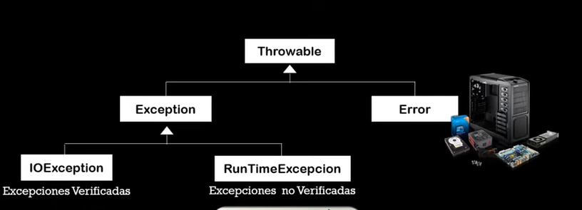

# EXEPCIONES
-En java los errores son conocidos como exepciones, cuando se produce una exepción, se crea un objeto del mismo tipo de la exepción, la clase Throwable, es la superclase de todas las clases de manejo de errores y tiene dos descendientes: Error, Exception.
    -Error: Son los errores graves en la maquina virtual de Java.
    -Exception: Representa errores que no son críticos, pueden ser tratados y dar continuación a la ejecución de la aplicación.

Cuando se genera una exepción, el programa en java busca un manejador para el error (handler); es una porción de código que identifica el tipo de objeto correspondiente al errore que se ha producido, y contiene sentencias que se van a ejecutar luego de que ocurrió el eror.

## Manejo de exepciones

try 
{
    char x = (char)System.in.read();
} 

catch (IOException ioe) 
{
    //Codigo para manejar el error
}

catch (Exception e) 
{
    //Codigo para manejar algunas excepciones
}

## Métodos de la clase Throwable
- String getMessage(): Retorna un mensaje grabado en el objeto de excepción.
- void printStackTrace(): Es util para determinar en que método ocurrió la excepción.
